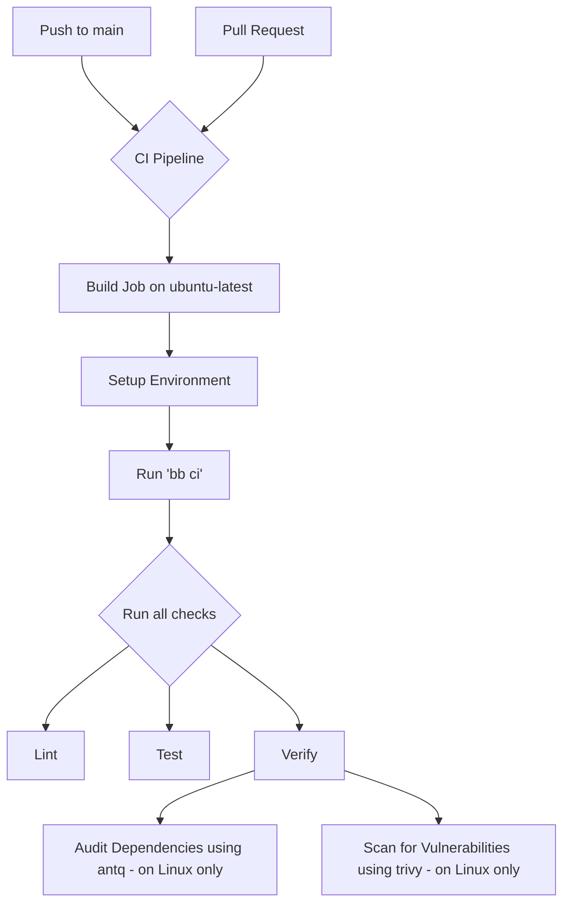
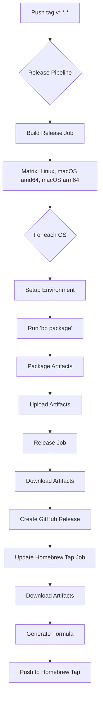

# Obsidize

Obsidize is a tool that aims to make it easy to import and maintain Claude conversation history and project data in Obsidian, converting the raw json files that Anthropic provides into a structured folder with proper linking and metadata, and implementing an update process that only process what's actually changed.

> While I followed software engineering best practices in developing and packaging this application it remains a personal project and may not cover all edge cases.
>
> The code, documentation and binaries are provided in the hope of being useful but without any warranty.
>
> The code is released under GNU Affero General Public License v3.0 (see [License](#license) for details).
>

## ✨ Features

- **🔄 Incremental Updates**: Detection of new and updated content - only processes what's changed
- **📦 Flexible Input Support**: Works with Claude data packs in .dms archive or folder format
- **🗂️ Structured Output**: Creates an organized Obsidian folder with conversations and projects notes
- **📋 Rich Metadata**: Includes YAML frontmatter with UUIDs, timestamps, and relationships
- **🏷️ Custom Tagging**: Allows adding custom tags and links to imported content via the command line
- **🛡️ Resilient Processing**: Handles missing or malformed data with detailed error reporting
- **🔄 Sync-Safe**: As it doesn't use any local/external state files the updates work across devices
- **🔍 Dry Run Mode**: Allows to preview changes before applying them
- **📊 Progress Reporting**: Clear feedback on what's being processed and updated


## 🚀 Quick Install

Obsidize is available as a binary via Homebrew (recommended for macOS users). For Linux, use homebrew if available or download the binaries from GitHub releases.

### Via Homebrew (macOS/Linux)

```bash
# Install
brew install stefanesco/obsidize/obsidize

# Update
brew upgrade obsidize
```

### Manual Download (macOS/Linux)

1. Go to the [latest GitHub release](https://github.com/stefanesco/obsidize/releases/latest).
2. Download the binary for your platform (e.g., `obsidize-macos-amd64.tar.gz` or `obsidize-linux-amd64.tar.gz`).
3. Extract and add to your PATH:

   ```bash
   tar -xzf obsidize-<platform>.tar.gz
   mv obsidize /usr/local/bin/  # Or any directory in your PATH
   ```

4. To update: Download the new version and replace the binary.

Verify installation:

```bash
obsidize --help
```

## ✨ Quick Usage

### Export your data

1. In **Claude**, go to your account -> ```Settings``` -> ```Privacy``` -> ```Export Data```
2. Use the download link to retrieve your data and save it as either a ```.dms``` file or an uncompressed folder.
3. the downloaded data should contain 3 files: ```conversations.json```, ```projects.json```, and ```users.json``` (don't worry about this - ```obsidize``` will handle it).

### First-Time Import

```bash
obsidize --input claude-export.dms --output-dir my-obsidian-vault
```

### Incremental Update (Default)

```bash
obsidize --input new-claude-export.dms --output-dir my-obsidian-vault
```
This only adds new/updated content.

### Preview Changes (Dry Run)
```bash
obsidize --input new-export.dms --output-dir my-obsidian-vault --dry-run
```

### Full Re-Import
```bash
obsidize --input export.dms --output-dir my-obsidian-vault --force-full
```

Add custom tags/links:
```bash
obsidize --input export.dms --output-dir my-obsidian-vault --tags ai,claude --links "[[AI Tools]]","[[Notes]]"
```

For full options, run `obsidize --help` (see below for details).

**Tips**:
- Backup your Obsidian vault before running.
- Use `--verbose` for detailed output.
- Output structure: Conversations as individual .md files; projects as folders with overviews and documents.

## 🚀 Quick Start

### Prerequisites

#### To use (macOS/Linux):
- [Homebrew](https://brew.sh/) package manager

#### To build:
- [Clojure CLI](https://clojure.org/guides/install_clojure)
- [Babashka](https://babashka.org/) (optional, for development tasks)

### Basic Usage

1. **First-time import of Claude data:**

```bash
clojure -M -m obsidize.core --input claude-export.dms --output-dir my-obsidian-vault
```

2. **Update existing vault with new Claude data (incremental - default behavior):**

```bash
# Smart incremental update - only processes new/updated content
clojure -M -m obsidize.core --input new-claude-export.dms --output-dir my-obsidian-vault

# Preview what would be updated without making changes
clojure -M -m obsidize.core --input new-export.dms --output-dir vault --dry-run

# Force complete re-import (ignores existing vault)
clojure -M -m obsidize.core --input export.dms --output-dir vault --force-full
```

3. **Advanced options:**

```bash
clojure -M -m obsidize.core \
  --input claude-export.dms \
  --output-dir vault/ \
  --tags ai,claude,imported \
  --links "[[Knowledge Base]]","[[AI Conversations]]" \
  --verbose
```

## 📚 Comprehensive Usage Examples

### Example 1: First-Time Import (Happy Path)

```bash
$ clojure -M -m obsidize.core --input claude-export-2025-08-06.dms --output-dir my-vault --verbose

Starting Claude to Obsidian conversion...
Options: {:input claude-export-2025-08-06.dms, :output-dir my-vault, :incremental true, :verbose true}
Found 15 conversations and 3 projects in Claude export.
Found 0 existing files in vault: 0 conversations, 0 projects.

📋 Update Plan:
  Conversations: 15 new, 0 updates, 0 unchanged
  Projects: 3 new, 0 updates, 0 unchanged

⚡ Processing updates...
✨ Creating new conversation: daily-planning__conv-123abc.md
✨ Creating new conversation: coding-help__conv-456def.md
✨ Creating new conversation: research-notes__conv-789ghi.md
[... 12 more conversations ...]
Processing project: AI Research Project
Creating file: my-vault/AI Research Project/ai-research-project.md
Creating file: my-vault/AI Research Project/1_literature-review.md
Creating file: my-vault/AI Research Project/2_experiment-design.md
[... 2 more projects ...]
✅ Processing complete!
```

**Result:** Clean vault with 15 conversation files and 3 project folders containing overview and document files.

### Example 2: Incremental Update (Happy Path)

```bash
$ clojure -M -m obsidize.core --input claude-export-2025-08-07.dms --output-dir my-vault

Starting Claude to Obsidian conversion...
Found 18 conversations and 4 projects in Claude export.
Scanning existing vault...
Found 24 existing files in vault: 15 conversations, 3 projects.

📋 Update Plan:
  Conversations: 3 new, 7 updates, 8 unchanged
  Projects: 1 new, 0 updates, 3 unchanged

⚡ Processing updates...
📝 Appending 2 new messages to: daily-planning__conv-123abc.md
📝 Appending 1 new messages to: coding-help__conv-456def.md
📝 Appending 4 new messages to: research-notes__conv-789ghi.md
[... 4 more updates ...]
✨ Creating new conversation: new-discussion__conv-newxyz.md
✨ Creating new conversation: latest-project__conv-latest1.md
✨ Creating new conversation: debug-session__conv-debug99.md
Processing project: Machine Learning Experiment
Creating file: my-vault/Machine Learning Experiment/machine-learning-experiment.md
Creating file: my-vault/Machine Learning Experiment/1_dataset-analysis.md
✅ Processing complete!
```

**Result:** Only changed content processed - 7 conversations updated with new messages, 3 new conversations created, 1 new project added. 8 conversations and 3 projects left unchanged.

### Example 3: Dry Run (Preview Mode)

```bash
$ clojure -M -m obsidize.core --input claude-export-large.dms --output-dir production-vault --dry-run

Starting Claude to Obsidian conversion...
Found 150 conversations and 25 projects in Claude export.
Scanning existing vault...
Found 120 existing files in vault: 100 conversations, 20 projects.

📋 Update Plan:
  Conversations: 50 new, 25 updates, 75 unchanged
  Projects: 5 new, 3 updates, 17 unchanged

🔍 Dry run mode - no changes will be made.
```

**Result:** Shows exactly what would be processed without making any changes - perfect for understanding the scope before running updates.

### Example 4: Force Full Re-import

```bash
$ clojure -M -m obsidize.core --input claude-export.dms --output-dir vault --force-full --verbose

Starting Claude to Obsidian conversion...
Found 10 conversations and 2 projects in Claude export.
Found 0 existing files in vault: 0 conversations, 0 projects.  # Existing vault ignored due to --force-full

📋 Update Plan:
  Conversations: 10 new, 0 updates, 0 unchanged
  Projects: 2 new, 0 updates, 0 unchanged

⚡ Processing updates...
[... processes everything as new ...]
✅ Processing complete!
```

**Result:** All content processed as new, regardless of existing vault content.

## 🚨 Error Scenarios and Handling

### Example 5: Missing Input File

```bash
$ clojure -M -m obsidize.core --input nonexistent.dms --output-dir vault

Error parsing arguments:
Input file must exist
```

**Solution:** Verify the file path and ensure the .dms file exists.

### Example 6: Corrupted Data Pack

```bash
$ clojure -M -m obsidize.core --input corrupted.dms --output-dir vault

Starting Claude to Obsidian conversion...
❌ Error processing Claude data pack:
  - Missing required files: conversations.json, projects.json
```

**Solution:** Re-export your data from Claude or extract the .dms file manually to inspect contents.

### Example 7: Malformed Claude Data (Robust Handling)

```bash
$ clojure -M -m obsidize.core --input malformed-export.dms --output-dir vault --verbose

Starting Claude to Obsidian conversion...
Found 12 conversations and 3 projects in Claude export.

🔍 Data Validation Report:
📝 Conversations: 10 valid, 2 invalid (success rate: 83%)
📁 Projects: 2 valid, 1 invalid (success rate: 67%)
⚠️  Some data validation issues found - check logs for details

Scanning existing vault...
Found 5 existing files in vault: 4 conversations, 1 projects.

📋 Update Plan:
  Conversations: 6 new, 0 updates, 4 unchanged
  Projects: 1 new, 0 updates, 1 unchanged

⚡ Processing updates...
✨ Creating new conversation: untitled-conversation__conv-recovered1.md  # Auto-recovered with fallback title
⏭️  No new messages for: existing-chat__conv-stable123.md
[...]
✅ Processing complete!
```

**Result:** Malformed data is automatically cleaned and recovered where possible. Invalid data is skipped with detailed reporting.

### Example 8: Permission Issues

```bash
$ clojure -M -m obsidize.core --input export.dms --output-dir /root/protected-folder

Starting Claude to Obsidian conversion...
Found 5 conversations and 1 projects in Claude export.
Exception: Permission denied - unable to create output directory
```

**Solution:** Use a directory you have write permissions for, or run with appropriate permissions.

### Example 9: Large Dataset with Progress Tracking

```bash
$ clojure -M -m obsidize.core --input huge-export.dms --output-dir enterprise-vault --verbose

Starting Claude to Obsidian conversion...
Found 500 conversations and 50 projects in Claude export.
Scanning existing vault...
Found 400 existing files in vault: 350 conversations, 50 projects.

📋 Update Plan:
  Conversations: 150 new, 200 updates, 150 unchanged
  Projects: 0 new, 25 updates, 25 unchanged

⚡ Processing updates...
📝 Appending 3 new messages to: project-alpha__conv-001.md
📝 Appending 1 new messages to: daily-standup__conv-002.md
📝 Appending 7 new messages to: architecture-discussion__conv-003.md
[... progress continues ...]
⏭️  No new messages for: completed-project__conv-400.md
Processing project: Updated Research Initiative  
Updating file: enterprise-vault/Research Initiative/research-initiative.md
[... continues processing 350 items ...]
✅ Processing complete!
```

**Result:** Handles large datasets efficiently with clear progress reporting throughout the process.

## 🔄 Incremental Update System (Deep Dive)

### How It Works

1. **Vault Scanning**: Reads existing Obsidian files and extracts `obsidized_at` timestamps from frontmatter
2. **Change Detection**: Compares vault timestamps with Claude's `updated_at` timestamps  
3. **Smart Planning**: Creates detailed update plan showing exactly what will be processed
4. **Selective Execution**: Only processes content that has actually changed

### Update Types Explained

- **New conversations**: UUID not found in vault → Create new markdown file
- **Updated conversations**: Claude `updated_at` > vault `obsidized_at` → Append new messages only
- **New projects**: UUID not found in vault → Create project folder with overview and documents
- **Updated projects**: Project metadata or documents changed → Update relevant files
- **Unchanged content**: No updates needed → Skip entirely (very fast)

### Frontmatter Schema

Each imported file includes comprehensive metadata:

```yaml
---
uuid: conv-123abc456def
created_at: 2025-08-04T10:30:00Z
updated_at: 2025-08-04T15:45:00Z  
obsidized_at: 2025-08-06T09:15:00Z    # Key: When last imported/updated
type: conversation                     # conversation, project-overview, project-document
source: claude-export
obsidize_version: 1.0.0
---
```

This metadata enables:
- **Precise update detection**: Only import content newer than `obsidized_at`
- **Cross-device compatibility**: No external state files needed for Obsidian sync
- **Recovery capabilities**: Can always resume by rescanning vault structure
- **Version tracking**: Know exactly when and how content was imported

## 📦 Output Structure

Obsidize creates a well-organized Obsidian vault:

```
my-obsidian-vault/
├── daily-planning__conv-123abc.md           # Conversation files
├── coding-help__conv-456def.md              # UUID in filename for uniqueness
├── research-notes__conv-789ghi.md
├── AI Research Project/                     # Project folders
│   ├── ai-research-project.md              # Project overview with document links
│   ├── 1_literature-review.md              # Chronologically ordered documents
│   └── 2_experiment-design.md
├── Machine Learning Experiment/
│   ├── machine-learning-experiment.md
│   ├── 1_dataset-analysis.md
│   ├── 2_model-training.md
│   └── 3_results-evaluation.md
└── Personal Notes/
    └── personal-notes.md                    # Projects with no documents
```

### File Naming Strategy

- **Conversations**: `{sanitized-title}__{uuid}.md`
- **Project Overviews**: `{sanitized-project-name}.md`
- **Project Documents**: `{index}_{sanitized-filename}.md`
- **Folders**: `{sanitized-project-name}/`

All names are sanitized for cross-platform compatibility while preserving readability.

## 🧪 Testing & Development

### Test Coverage

The project includes **comprehensive test coverage** with 65+ test assertions:

- **Unit Tests**: Data validation, frontmatter parsing, timestamp logic, filename sanitization
- **Integration Tests**: Full vault scanning, update planning, message appending
- **End-to-End Tests**: Complete incremental workflow scenarios
- **Edge Case Tests**: Empty vaults, malformed data, permission issues, large datasets

```bash
# Run all tests
bb test:clj                                           # Should show 65+ assertions passing

# Run specific test suites
clojure -M:test --focus obsidize.vault-scanner-test          # Vault scanning logic
clojure -M:test --focus obsidize.conversation-appending-test # Message appending
clojure -M:test --focus obsidize.data-validation-test       # Data validation
clojure -M:test --focus obsidize.end-to-end-incremental-test # Full workflows
```

### Development Commands

```bash
# Development workflow
bb init                    # Install dependencies  
bb test:clj               # Run all tests (65+ assertions)
bb lint:clj               # Code quality checks
bb check                  # Full CI pipeline

# Manual testing with REPL
clojure -M:nrepl          # Start REPL on port 7888
```

### Performance Testing

For large datasets:

```bash
# Test with sample data
time clojure -M -m obsidize.core \
  --input resources/data/local/sample-export.dms \
  --output-dir benchmark-vault \
  --verbose

# Benchmark incremental updates  
time clojure -M -m obsidize.core \
  --input resources/data/local/incremental-export.dms \
  --output-dir existing-large-vault \
  --dry-run
```

## 🏗️ Architecture

### Core Components

- **`obsidize.core`**: Main CLI interface and workflow orchestration
- **`obsidize.data-pack`**: Input detection, extraction, and validation
- **`obsidize.vault-scanner`**: Existing vault analysis and update planning  
- **`obsidize.conversations`**: Conversation processing and incremental message appending
- **`obsidize.projects`**: Project processing and folder structure creation
- **`obsidize.data-validation`**: Robust data validation preventing NullPointerExceptions

### Processing Pipeline

1. **Input Processing**: Detect and extract data from folders or .dms archives
2. **Data Validation**: Clean and validate Claude data, filtering out malformed entries
3. **Vault Scanning**: Index existing content and extract metadata from frontmatter
4. **Update Planning**: Compare Claude data with vault state, create detailed update plan
5. **Selective Processing**: Execute only necessary updates (create/append/skip)
6. **Progress Reporting**: Provide clear feedback throughout the process
7. **Cleanup**: Remove temporary files and report completion

### Key Design Principles

- **Functional Programming**: Pure functions for data transformation, clear separation of concerns
- **Incremental by Default**: Only process what's actually changed
- **Resilient Error Handling**: Graceful degradation with detailed error messages and recovery
- **Sync-Safe Architecture**: No external state files - all state embedded in vault structure
- **User-Centric UX**: Clear progress reporting, dry-run mode, comprehensive help text

## 🛠️ CLI Reference

```bash
clojure -M -m obsidize.core [options]

Options:
  -i, --input FILE         Path to Claude data pack (.dms archive or folder)
  -o, --output-dir DIR     Directory to save the Obsidian notes (default: obsidian_vault)
  -t, --tags TAGS          Comma-separated tags to add to all notes  
  -l, --links LINKS        Comma-separated Obsidian links to add to all notes
      --incremental        Enable incremental updates (default: true)
      --force-full         Force full re-import, ignore existing vault
      --dry-run           Show what would be done without making changes
  -v, --verbose           Verbose output with detailed progress
  -d, --debug             Enable debug logging for troubleshooting
      --diagnostics       Run system diagnostics and exit
  -V, --version           Show version information
  -h, --help              Show help message

Examples:
  # First import
  obsidize --input data.dms --output-dir vault/

  # Preview updates  
  obsidize --input new-data.dms --output-dir vault/ --dry-run
  
  # Complete re-import
  obsidize --input data.dms --output-dir vault/ --force-full
  
  # Detailed progress with custom tags
  obsidize --input data/ --output-dir vault/ --verbose --tags work,ai
```

## 🔍 Troubleshooting

### Common Issues

**"Input file must exist"**

```bash
# Check file path and permissions
ls -la path/to/your-export.dms
file your-export.dms  # Should show "Zip archive data"
```

**"Missing required files"**

```bash
# Check data pack contents
unzip -l your-export.dms | grep -E "(conversations|projects)\\.json"
```

**Slow processing on large vaults**

```bash
# Use incremental mode (default) instead of --force-full
obsidize --input new-export.dms --output-dir large-vault/
```

**Updates not detected**

```bash
# Check frontmatter in existing files
head -10 vault/some-conversation.md  # Should show obsidized_at timestamp
```

**Permission denied errors**

```bash
# Ensure write permissions to output directory
chmod 755 /path/to/output-directory
# Or use a different output directory
obsidize --input export.dms --output-dir ~/Documents/my-vault/
```

### Advanced Troubleshooting

**Debug mode with maximum verbosity:**

```bash
clojure -M -m obsidize.core \
  --input problematic-export.dms \
  --output-dir debug-vault \
  --verbose \
  --dry-run  # Safe to run multiple times
```

**Manual data pack inspection:**

```bash
# Extract .dms file manually
unzip problematic-export.dms -d extracted-data/
ls -la extracted-data/
# Check JSON structure
head -50 extracted-data/conversations.json
head -50 extracted-data/projects.json
```

**Verify setup:**

```bash
# Test with sample data
clojure -M -m obsidize.core \
  --input resources/data/local/data-2025-08-04-11-59-03-batch-0000.dms \
  --output-dir test-output \
  --dry-run \
  --verbose
```


### Development Workflow

```bash
bb init          # Setup dependencies
bb test:clj      # Run tests (should show 65+ assertions)
bb lint:clj      # Code quality checks  
bb check         # Full CI pipeline
```

### Test Categories

- **Unit tests**: Pure function testing with edge cases
- **Integration tests**: Component interaction testing
- **End-to-end tests**: Full workflow scenario testing
- **Performance tests**: Large dataset and memory usage testing

## Build and Release

This project uses GitHub Actions for CI/CD. There are two main pipelines: the CI pipeline and the Release pipeline.

### CI Pipeline

The CI pipeline runs on every push to the `main` branch and on every pull request. It ensures that the code is always in a good state.



**Stages:**

1. **Trigger:** The pipeline is triggered by a push to `main` or a pull request.
2. **Build Job:** A single job runs on an `ubuntu-latest` runner.
3. **Setup Environment:** The job checks out the code, sets up caches, Java, Clojure, and other dependencies.
4. **Run Checks:** The job executes the `bb ci` command, which runs all the necessary checks:
  a. **Lint:** Lints the Clojure code using `clj-kondo`.
  b. **Test:** Runs the test suite using `kaocha`.
  c. **Verify:** Performs security-related checks:
     i. **Audit Dependencies:** Checks for outdated dependencies using `antq`. This step only runs on Linux.
     ii. **Scan for Vulnerabilities:** Scans for vulnerabilities in the dependencies using `trivy`. This step also only runs on Linux.

### Release Pipeline

The Release pipeline runs when a new tag is pushed to the repository (e.g., `v0.1.0`). It builds the native executables for Linux and macOS, creates a GitHub Release, and publishes the new version to a Homebrew tap.

This pipeline can also be triggered manually from the GitHub Actions UI for testing purposes (in "dry-run" mode).



**Stages:**

1. **Trigger:** The pipeline is triggered by a push of a tag that starts with `v`.
2. **Build Release Job:** This job runs on a matrix of operating systems (Linux, macOS amd64, macOS arm64). For each OS, it:
   a. Sets up the environment with GraalVM.
   b. Runs the `bb package` command, which builds the native executable. This command also runs all the CI checks.
   c. Packages the executable into a `.tar.gz` archive and calculates its SHA256 hash.
   d. Uploads the archive and the SHA256 hash as artifacts.
3. **Release Job:** This job runs after all the build jobs are complete. It:
    a. Downloads all the release artifacts.
    b. Creates a new GitHub Release and attaches all the archives to it.
4. **Update Homebrew Tap Job:** This job runs after the release is created. It:
    a. Downloads the release artifacts.
    b. Generates a new Homebrew formula with the updated version and SHA256 hashes.
    c. Pushes the new formula to the Homebrew tap repository.

**Gates:**

1. The `release` job will only run if the `build-release` job completes successfully for all operating systems.
2. The `update-homebrew` job will only run if the `release` job completes successfully.
3. The actual release to GitHub and the push to the Homebrew tap are gated and will not run in "dry-run" mode.

**Targets:**

- The final targets of the pipeline are:
  - A new GitHub Release with the native executables for Linux and macOS.
  - An updated Homebrew formula for easy installation on macOS.

### Testing the Release Pipeline

The release pipeline can be tested without creating a real release by using the `workflow_dispatch` trigger. This allows you to run the pipeline manually on any branch and inspect the results.

To test the release pipeline:

1. Go to the **Actions** tab in your GitHub repository.
2. In the left sidebar, click on the **"Create Release"** workflow.
3. You will see a **"Run workflow"** button. Click on it.
4. A dialog will appear with the following options:
    - **Version:** The version to use for the test run (e.g., `v0.0.0-test`). This allows you to test the versioning logic without creating a real git tag.
    - **Dry-run:** If checked (the default), the workflow will run all the build and packaging steps but will skip the final steps of creating the GitHub Release and pushing to the Homebrew tap.

This is a safe and effective way to test any changes to the release process.

## 📝 <a name="license"></a>License

GNU Affero General Public License v3.0

Copyright (c) 2025 Tudor Stefanescu

### License Summary

- ✅ **Use freely** for personal projects, internal business tools, and development
- ✅ **Modify and distribute** - improvements and forks are welcome  
- ✅ **Commercial use** - businesses can use this internally without restrictions
- ⚠️ **Network copyleft** - if you offer this as a service to others, you must open source your entire service stack
- 📤 **Share improvements** - modifications must be shared under the same license

This license ensures the project remains open source while preventing commercial exploitation without contribution back to the community.
