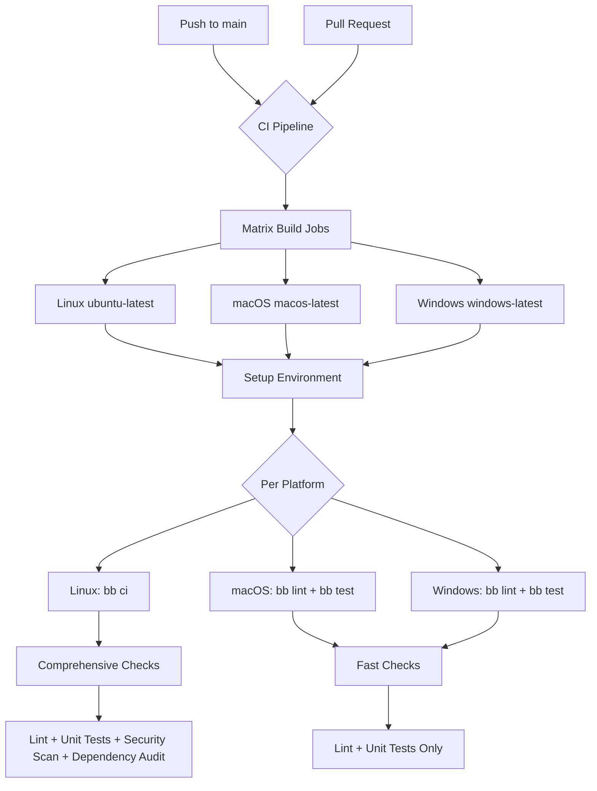
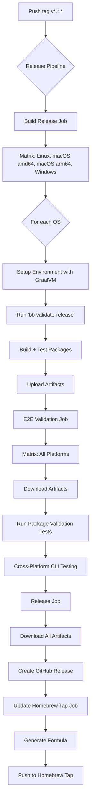

# Obsidize

[](https://github.com/stefanesco/obsidize/actions/workflows/ci.yml)
[](https://github.com/stefanesco/obsidize/actions/workflows/release.yml)
[](https://github.com/stefanesco/obsidize/releases/latest)
[](https://www.gnu.org/licenses/agpl-3.0)
[](https://clojure.org)

Obsidize is a tool that aims to make it easy to import and maintain the conversation history exported from Claude in Obsidian - it converts the raw json files that Anthropic provides into a structured folder with proper linking and metadata, and implements an update process that keeps any local edits and adds only the new conversations.

> Disclaimer:
> While I aimed to implement 'obsidize' using software engineering best practices it remains a personal project.
>
> The code, documentation and binaries are provided in the hope of being useful but without any warranty.
>
> The code is released under GNU Affero General Public License v3.0 (see [License](#license) for details).
>

## ✨ Features

- **🔄 Incremental Updates**: Detection of new and updated content - only processes what's changed
- **📦 Flexible Input Support**: Works with Claude data packs in .dms archive or folder format
- **🗂️ Structured Output**: Creates an organized Obsidian folder with conversations and projects notes
- **📋 Rich Metadata**: Includes YAML frontmatter with UUIDs, timestamps, and relationships
- **🏷️ Custom Tagging**: Allows adding custom tags and links to imported content via the command line
- **🛡️ Resilient Processing**: Handles missing or malformed data with detailed error reporting
- **🔄 Sync-Safe**: As it doesn't use any local/external state files the updates work across devices
- **🔍 Dry Run Mode**: Allows to preview changes before applying them
- **📊 Progress Reporting**: Clear feedback on what's being processed and updated

## &#128190; Obsidize Package Distribution

### 📦 **Packaging Strategy**

Obsidize uses an **optimized packaging strategy** that provides the best installation method for each platform:

1. **📄 Universal JAR**: Works on any platform with Java 21+ 
2. **🍺 Platform-Optimized Homebrew Packages**:
   - **macOS**: Native executable (GraalVM) - fastest startup, no Java required
   - **Linux**: JLink runtime bundle - includes optimized JRE, reliable cross-distro support

### ✅ **Supported Platforms**

- **macOS (Intel/Apple Silicon)**: 
  - 🥇 **Homebrew** (native executable - recommended)
  - 📄 Universal JAR
- **Linux (x86_64)**:
  - 🥇 **Homebrew** (JLink runtime - recommended) 
  - 📄 Universal JAR
- **All Java Platforms**:
  - 📄 **Universal JAR** (requires Java 21+)

### ⚠️ **Development Status**

- **Windows**: Universal JAR available, optimized packaging in development
  - Build system integration is incomplete  
  - Tracked in [Windows Support Roadmap](#-windows-support-roadmap)

## 🚀 Quick Install

### Via Homebrew (macOS/Linux)

If not done already, install [Homebrew](https://brew.sh/)

Install/Update `obsidize`:
```bash
# Install
brew install stefanesco/obsidize/obsidize

# Update
brew upgrade obsidize
```

### Manual Download (macOS/Linux)

From the [latest GitHub release](https://github.com/stefanesco/obsidize/releases/latest):

**📄 Universal JAR (All Platforms)**
```bash
# Download obsidize-standalone.jar
# Requires Java 21+ installed
java -jar obsidize-standalone.jar --help
```

**🍺 Platform-Optimized Packages**

**macOS** - Native executable:
```bash
# Download: obsidize-native-<version>-macos-aarch64.tar.gz (Apple Silicon)
#       or: obsidize-native-<version>-macos-x64.tar.gz (Intel)
tar -xzf obsidize-native-<version>-macos-*.tar.gz
./obsidize-native-<version>-macos-*/bin/obsidize --help

# Add to PATH
sudo cp obsidize-native-<version>-macos-*/bin/obsidize /usr/local/bin/
```

**Linux** - JLink runtime (includes JRE):
```bash
# Download: obsidize-<version>-linux-amd64.tar.gz
tar -xzf obsidize-<version>-linux-amd64.tar.gz
./obsidize-<version>-linux-amd64/bin/obsidize --help

# Add to PATH  
sudo cp -r obsidize-<version>-linux-amd64 /usr/local/
sudo ln -sf /usr/local/obsidize-<version>-linux-amd64/bin/obsidize /usr/local/bin/obsidize
```

#### Verify installation

- a. Display the `obsidize` usage/help message:

```bash
obsidize --help
```

- b. Display diagnostics information:

```bash
obsidize --diagnostics
```

Success! You are now ready to use `obsidize`.

## ✨ Quick Usage

### Export your data

1. In **Claude**, go to your account -> ```Settings``` -> ```Privacy``` -> ```Export Data```
2. Use the download link and retrieve the data: either as an archive (e.g. ```.dms```) or an uncompressed folder. The downloaded data should contain 3 files: ```conversations.json```, ```projects.json```, and ```users.json``` (```obsidize``` reads only ```conversations.json``` and ```projects.json```).

### First-Time Import

```bash
obsidize --input claude-export.dms --output-dir my-obsidian-vault
```

### Incremental Update (Default)

```bash
obsidize --input new-claude-export.dms --output-dir my-obsidian-vault
```
This only adds new/updated content.

### Preview Changes (Dry Run)
```bash
obsidize --input new-export.dms --output-dir my-obsidian-vault --dry-run
```

### Full Re-Import
Use this if you inadvertently deleted imported data but be aware that you will lose any local edits in the conversation notes.
```bash
obsidize --input export.dms --output-dir my-obsidian-vault --force-full
```

Add custom tags/links:
```bash
obsidize --input export.dms --output-dir my-obsidian-vault --tags ai,claude --links "[[AI Tools]]","[[Notes]]"
```

For the list of full options, run `obsidize --help` (see below for details).

**Tips**:

- For increased safety: backup your Obsidian vault before running, or use a temporary folder as output and move the created files in your vault manually.
- Use `--verbose` for detailed output.
- Output structure: Conversations as individual .md files; projects as folders with overviews and documents.

## 🚀 Quick Start

### Prerequisites

#### To use

- all releases contain a selfcontained executable and also the standalone jar.

#### To build

- Java
- Native image: GraalVM
- [Clojure CLI](https://clojure.org/guides/install_clojure)
- [Babashka](https://babashka.org/) (optional, for development tasks)

### Basic Usage

1. **First-time import of Claude data:**

```bash
clojure -M -m obsidize.core --input claude-export.dms --output-dir my-obsidian-vault
```

2. **Update existing vault with new Claude data (incremental - default behavior):**

```bash
# Smart incremental update - only processes new/updated content
clojure -M -m obsidize.core --input new-claude-export.dms --output-dir my-obsidian-vault

# Preview what would be updated without making changes
clojure -M -m obsidize.core --input new-export.dms --output-dir vault --dry-run

# Force complete re-import (ignores existing vault)
clojure -M -m obsidize.core --input export.dms --output-dir vault --force-full
```

3. **Advanced options:**

```bash
clojure -M -m obsidize.core \
  --input claude-export.dms \
  --output-dir vault/ \
  --tags ai,claude,imported \
  --links "[[Knowledge Base]]","[[AI Conversations]]" \
  --verbose
```

## 📚 Comprehensive Usage Examples

### Example 1: First-Time Import (Happy Path)

```bash
$ clojure -M -m obsidize.core --input claude-export-2025-08-06.dms --output-dir my-vault --verbose

Starting Claude to Obsidian conversion...
Options: {:input claude-export-2025-08-06.dms, :output-dir my-vault, :incremental true, :verbose true}
Found 15 conversations and 3 projects in Claude export.
Found 0 existing files in vault: 0 conversations, 0 projects.

📋 Update Plan:
  Conversations: 15 new, 0 updates, 0 unchanged
  Projects: 3 new, 0 updates, 0 unchanged

⚡ Processing updates...
✨ Creating new conversation: daily-planning__conv-123abc.md
✨ Creating new conversation: coding-help__conv-456def.md
✨ Creating new conversation: research-notes__conv-789ghi.md
[... 12 more conversations ...]
Processing project: AI Research Project
Creating file: my-vault/AI Research Project/ai-research-project.md
Creating file: my-vault/AI Research Project/1_literature-review.md
Creating file: my-vault/AI Research Project/2_experiment-design.md
[... 2 more projects ...]
✅ Processing complete!
```

**Result:** Clean vault with 15 conversation files and 3 project folders containing overview and document files.

### Example 2: Incremental Update (Happy Path)

```bash
$ clojure -M -m obsidize.core --input claude-export-2025-08-07.dms --output-dir my-vault

Starting Claude to Obsidian conversion...
Found 18 conversations and 4 projects in Claude export.
Scanning existing vault...
Found 24 existing files in vault: 15 conversations, 3 projects.

📋 Update Plan:
  Conversations: 3 new, 7 updates, 8 unchanged
  Projects: 1 new, 0 updates, 3 unchanged

⚡ Processing updates...
📝 Appending 2 new messages to: daily-planning__conv-123abc.md
📝 Appending 1 new messages to: coding-help__conv-456def.md
📝 Appending 4 new messages to: research-notes__conv-789ghi.md
[... 4 more updates ...]
✨ Creating new conversation: new-discussion__conv-newxyz.md
✨ Creating new conversation: latest-project__conv-latest1.md
✨ Creating new conversation: debug-session__conv-debug99.md
Processing project: Machine Learning Experiment
Creating file: my-vault/Machine Learning Experiment/machine-learning-experiment.md
Creating file: my-vault/Machine Learning Experiment/1_dataset-analysis.md
✅ Processing complete!
```

**Result:** Only changed content processed - 7 conversations updated with new messages, 3 new conversations created, 1 new project added. 8 conversations and 3 projects left unchanged.

### Example 3: Dry Run (Preview Mode)

```bash
$ clojure -M -m obsidize.core --input claude-export-large.dms --output-dir production-vault --dry-run

Starting Claude to Obsidian conversion...
Found 150 conversations and 25 projects in Claude export.
Scanning existing vault...
Found 120 existing files in vault: 100 conversations, 20 projects.

📋 Update Plan:
  Conversations: 50 new, 25 updates, 75 unchanged
  Projects: 5 new, 3 updates, 17 unchanged

🔍 Dry run mode - no changes will be made.
```

**Result:** Shows exactly what would be processed without making any changes - perfect for understanding the scope before running updates.

### Example 4: Force Full Re-import

```bash
$ clojure -M -m obsidize.core --input claude-export.dms --output-dir vault --force-full --verbose

Starting Claude to Obsidian conversion...
Found 10 conversations and 2 projects in Claude export.
Found 0 existing files in vault: 0 conversations, 0 projects.  # Existing vault ignored due to --force-full

📋 Update Plan:
  Conversations: 10 new, 0 updates, 0 unchanged
  Projects: 2 new, 0 updates, 0 unchanged

⚡ Processing updates...
[... processes everything as new ...]
✅ Processing complete!
```

**Result:** All content processed as new, regardless of existing vault content.

## 🚨 Error Scenarios and Handling

### Example 5: Missing Input File

```bash
$ clojure -M -m obsidize.core --input nonexistent.dms --output-dir vault

Error parsing arguments:
Input file must exist
```

**Solution:** Verify the file path and ensure the .dms file exists.

### Example 6: Corrupted Data Pack

```bash
$ clojure -M -m obsidize.core --input corrupted.dms --output-dir vault

Starting Claude to Obsidian conversion...
❌ Error processing Claude data pack:
  - Missing required files: conversations.json, projects.json
```

**Solution:** Re-export your data from Claude or extract the .dms file manually to inspect contents.

### Example 7: Malformed Claude Data (Robust Handling)

```bash
$ clojure -M -m obsidize.core --input malformed-export.dms --output-dir vault --verbose

Starting Claude to Obsidian conversion...
Found 12 conversations and 3 projects in Claude export.

🔍 Data Validation Report:
📝 Conversations: 10 valid, 2 invalid (success rate: 83%)
📁 Projects: 2 valid, 1 invalid (success rate: 67%)
⚠️  Some data validation issues found - check logs for details

Scanning existing vault...
Found 5 existing files in vault: 4 conversations, 1 projects.

📋 Update Plan:
  Conversations: 6 new, 0 updates, 4 unchanged
  Projects: 1 new, 0 updates, 1 unchanged

⚡ Processing updates...
✨ Creating new conversation: untitled-conversation__conv-recovered1.md  # Auto-recovered with fallback title
⏭️  No new messages for: existing-chat__conv-stable123.md
[...]
✅ Processing complete!
```

**Result:** Malformed data is automatically cleaned and recovered where possible. Invalid data is skipped with detailed reporting.

### Example 8: Permission Issues

```bash
$ clojure -M -m obsidize.core --input export.dms --output-dir /root/protected-folder

Starting Claude to Obsidian conversion...
Found 5 conversations and 1 projects in Claude export.
Exception: Permission denied - unable to create output directory
```

**Solution:** Use a directory you have write permissions for, or run with appropriate permissions.

### Example 9: Large Dataset with Progress Tracking

```bash
$ clojure -M -m obsidize.core --input huge-export.dms --output-dir enterprise-vault --verbose

Starting Claude to Obsidian conversion...
Found 500 conversations and 50 projects in Claude export.
Scanning existing vault...
Found 400 existing files in vault: 350 conversations, 50 projects.

📋 Update Plan:
  Conversations: 150 new, 200 updates, 150 unchanged
  Projects: 0 new, 25 updates, 25 unchanged

⚡ Processing updates...
📝 Appending 3 new messages to: project-alpha__conv-001.md
📝 Appending 1 new messages to: daily-standup__conv-002.md
📝 Appending 7 new messages to: architecture-discussion__conv-003.md
[... progress continues ...]
⏭️  No new messages for: completed-project__conv-400.md
Processing project: Updated Research Initiative  
Updating file: enterprise-vault/Research Initiative/research-initiative.md
[... continues processing 350 items ...]
✅ Processing complete!
```

**Result:** Handles large datasets efficiently with clear progress reporting throughout the process.

## 🔄 Incremental Update System (Deep Dive)

### How It Works

1. **Vault Scanning**: Reads existing Obsidian files and extracts `obsidized_at` timestamps from frontmatter
2. **Change Detection**: Compares vault timestamps with Claude's `updated_at` timestamps  
3. **Smart Planning**: Creates detailed update plan showing exactly what will be processed
4. **Selective Execution**: Only processes content that has actually changed

### Update Types Explained

- **New conversations**: UUID not found in vault → Create new markdown file
- **Updated conversations**: Claude `updated_at` > vault `obsidized_at` → Append new messages only
- **New projects**: UUID not found in vault → Create project folder with overview and documents
- **Updated projects**: Project metadata or documents changed → Update relevant files
- **Unchanged content**: No updates needed → Skip entirely (very fast)

### Frontmatter Schema

Each imported file includes comprehensive metadata:

```yaml
---
uuid: conv-123abc456def
created_at: 2025-08-04T10:30:00Z
updated_at: 2025-08-04T15:45:00Z  
obsidized_at: 2025-08-06T09:15:00Z    # Key: When last imported/updated
type: conversation                     # conversation, project-overview, project-document
source: claude-export
obsidize_version: 1.0.0
---
```

This metadata enables:
- **Precise update detection**: Only import content newer than `obsidized_at`
- **Cross-device compatibility**: No external state files needed for Obsidian sync
- **Recovery capabilities**: Can always resume by rescanning vault structure
- **Version tracking**: Know exactly when and how content was imported

## 📦 Output Structure

Obsidize creates a well-organized Obsidian vault:

```
my-obsidian-vault/
├── daily-planning__conv-123abc.md           # Conversation files
├── coding-help__conv-456def.md              # UUID in filename for uniqueness
├── research-notes__conv-789ghi.md
├── AI Research Project/                     # Project folders
│   ├── ai-research-project.md              # Project overview with document links
│   ├── 1_literature-review.md              # Chronologically ordered documents
│   └── 2_experiment-design.md
├── Machine Learning Experiment/
│   ├── machine-learning-experiment.md
│   ├── 1_dataset-analysis.md
│   ├── 2_model-training.md
│   └── 3_results-evaluation.md
└── Personal Notes/
    └── personal-notes.md                    # Projects with no documents
```

### File Naming Strategy

- **Conversations**: `{sanitized-title}__{uuid}.md`
- **Project Overviews**: `{sanitized-project-name}.md`
- **Project Documents**: `{index}_{sanitized-filename}.md`
- **Folders**: `{sanitized-project-name}/`

All names are sanitized for cross-platform compatibility while preserving readability.

## 🧪 Testing & Development

### Test Coverage

The project includes **comprehensive test coverage** with 520+ test assertions across multiple test categories:

- **Unit Tests** (96 test suites, 480+ assertions): Data validation, frontmatter parsing, timestamp logic, filename sanitization
- **Integration Tests**: Full vault scanning, update planning, message appending
- **End-to-End Tests** (5 test suites, 36 assertions): Package validation with real CLI execution
- **Edge Case Tests**: Empty vaults, malformed data, permission issues, large datasets

```bash
# Run unit tests (fast - used in development)
bb test                   # Run all unit tests (96 test suites, 480+ assertions)

# Run end-to-end package validation (slower - validates compiled artifacts)
bb test-e2e              # Test JAR, native image, and CLI functionality (5 tests, 36 assertions)

# Run comprehensive validation (build + test packages)
bb validate-release       # Build all packages and run e2e validation

# Run specific test suites
clojure -M:test :unit --focus obsidize.vault-scanner-test          # Vault scanning logic
clojure -M:test :unit --focus obsidize.conversation-appending-test # Message appending
clojure -M:test :unit --focus obsidize.data-validation-test       # Data validation
clojure -M:test :unit --focus obsidize.end-to-end-incremental-test # Full workflows
clojure -M:test :e2e --focus e2e.package-validation-test          # Package validation
```

### Test Categories

- **Unit Tests**: Pure function testing with edge cases (fast feedback during development)
- **Integration Tests**: Component interaction testing
- **End-to-End Tests**: Real package validation with CLI execution
- **Package Validation Tests**: Cross-platform compatibility and performance testing
- **Performance Tests**: Large dataset and memory usage testing

### Development Commands

```bash
# Development workflow
bb init                    # Install dependencies  
bb test                   # Run unit tests (96 test suites, 480+ assertions)
bb lint                   # Code quality checks
bb check                  # Full CI pipeline (unit tests + security + audit)

# Package building and validation
bb package                # Build all packages (JAR, native-image, jlink)
bb validate-release       # Build packages + run e2e validation
bb test-e2e              # Run e2e tests on existing packages

# Manual testing with REPL
clojure -M:nrepl          # Start REPL on port 7888
```

### Performance Testing

For large datasets:

```bash
# Test with sample data
time clojure -M -m obsidize.core \
  --input resources/data/local/sample-export.dms \
  --output-dir benchmark-vault \
  --verbose

# Benchmark incremental updates  
time clojure -M -m obsidize.core \
  --input resources/data/local/incremental-export.dms \
  --output-dir existing-large-vault \
  --dry-run
```

## 🔨 Build Options & Approaches

### Overview

Obsidize supports multiple build approaches optimized for different use cases: local development, CI/CD pipelines, and production releases. Each approach has specific requirements and configurations.

### Build Approaches

#### 1. **Local Development Build**

**Purpose**: Fast iteration during development and testing  
**Output**: Standalone JAR file for immediate testing

```bash
# Prerequisites
- Java 21+ (any distribution)
- Clojure CLI 
- Babashka (for task automation)

# Quick setup
bb init                 # Install dependencies
bb test                 # Verify everything works

# Build standalone JAR
bb uber-runtime         # Creates target/obsidize-standalone.jar

# Test the JAR
java -jar target/obsidize-standalone.jar --help
```

**Configuration**: Uses default settings with minimal external dependencies.

#### 2. **CI Pipeline Build**

**Purpose**: Automated quality assurance, testing, and artifact validation  
**Triggers**: Push to `main`, Pull Requests  
**Platforms**: Linux (ubuntu-latest), macOS (macos-latest), Windows (windows-latest)

```bash
# Full CI pipeline (Linux only - includes security scanning)
bb ci                   # Equivalent to: init + lint + test + audit + trivy-scan

# Platform-specific builds (macOS/Windows)
bb lint                 # Code quality checks
bb test                 # Test suite execution
```

**Key Features**:

- **Multi-platform testing** across Linux, macOS, Windows
- **Security scanning** with Trivy (Linux only)
- **Dependency auditing** with antq (Linux only) 
- **Configurable tool versions** via GitHub repository variables
- **Artifact caching** for faster builds

**Required Configurations**:
```yaml
# GitHub repository secrets (optional - uses secure defaults)
vars:
  JAVA_VERSION: "21"                    # Override Java version
  CLOJURE_CLI_VERSION: "1.12.1.1550"   # Pin Clojure CLI version
  TRIVY_GPG_KEY_ID: "E9D0A3616276FA6C" # Override security keys
```

#### 3. **Release Build**

**Purpose**: Production-ready artifacts with comprehensive e2e validation across all platforms  
**Triggers**: Git tags (`v*.*.*`), Manual workflow dispatch  
**Platforms**: Linux (amd64), macOS (amd64/arm64), Windows (amd64)

```bash
# Complete release pipeline with validation
bb validate-release     # Equivalent to: package + test-e2e (build + comprehensive validation)

# Alternative: Step-by-step release building
bb package              # Build all packages (JAR, native-image, jlink)
bb test-e2e             # Run package validation tests

# Individual release components
bb native-image         # GraalVM native executable (macOS only by default)
bb jlink-image          # JVM runtime bundle (all platforms)
bb dist                 # List built artifacts
```

**Artifact Types**:
1. **Native Executables**: 
   - `obsidize-native-{version}-{platform}.tar.gz`
   - Standalone binaries (currently macOS only)
   - Fastest startup, no JVM required

2. **JLink Runtime Bundles**:
   - `obsidize-{version}-{platform}.tar.gz` / `.zip`  
   - Bundled JVM runtime + application
   - Cross-platform, predictable performance

3. **Uber JAR**:
   - `obsidize-standalone.jar`
   - Universal compatibility, requires Java 21+

**Required Configurations**:
```yaml
# GitHub repository secrets (required for release)
secrets:
  GITHUB_TOKEN: ${{ secrets.GITHUB_TOKEN }}          # Auto-provided
  HOMEBREW_TAP_TOKEN: ${{ secrets.HOMEBREW_TAP_TOKEN }} # For Homebrew publishing

# GitHub repository variables (required for Homebrew)
vars:
  HOMEBREW_TAP_REPO: "username/homebrew-tap"         # Target tap repository
```

### Build Configuration Matrix

| Build Type | Java | Package Strategy | Security Scan | Platforms | Artifacts |
|------------|------|------------------|---------------|-----------|-----------|
| **Local** | Any 21+ | Universal JAR | No | Current OS | JAR |
| **CI** | Temurin 21 | Platform Testing | Yes (Linux) | Linux, macOS, ⚠️ Windows* | None |
| **Release** | GraalVM 21 | **Optimized per Platform** | Yes (Linux) | Linux, macOS (x64/arm64), ⚠️ Windows* | **JAR + Platform-Optimized** |

**Release Artifacts by Platform:**
- **macOS**: Universal JAR + Native executable package  
- **Linux**: Universal JAR + JLink runtime package
- **Windows**: Universal JAR only (optimized packaging in development)

*Windows builds are experimental and may fail (non-blocking)

### Native Image Compilation

**Requirements**:

```bash
# GraalVM with native-image tool
bb native-prereqs      # Check prerequisites
```

**Platform Support**:

- **macOS**: ✅ **Production ready** - Native executables for Homebrew distribution
- **Linux**: 🔄 **Not prioritized** - JLink provides better cross-distro compatibility  
- **Windows**: ❌ **Not supported** - Build system issues prevent compilation

**Native Image Features**:
- **ZIP file handling**: Complete java.util.zip support
- **Reflection configuration**: Pre-configured for Clojure runtime
- **System integration**: File I/O, environment variables, process execution
- **Diagnostics**: Built-in troubleshooting with `--diagnostics` flag

**Configuration Files**:
```
resources/META-INF/native-image/obsidize/
├── reflect-config.json       # Reflection metadata
├── resource-config.json      # Bundled resources  
├── jni-config.json          # JNI configuration
├── proxy-config.json        # Dynamic proxy support
└── serialization-config.json # Serialization support
```

### Environment Customization

All builds support extensive customization through GitHub repository/organization variables:

**Common Overrides**:
```yaml
# Tool versions
JAVA_VERSION: "17"                    # Use Java 17 instead of 21
BABASHKA_VERSION: "1.3.190"          # Pin specific Babashka version
CLOJURE_CLI_VERSION: "1.11.4.1474"  # Use older Clojure CLI

# Security settings  
CLOJURE_INSTALL_SHA256: "custom-hash" # Custom installer validation
TRIVY_GPG_KEY_ID: "custom-key-id"     # Override security keys

# GitHub Actions versions
CHECKOUT_ACTION_VERSION: "v4"         # Pin for security compliance
CACHE_ACTION_VERSION: "v3"           # Use older cache action
```

See [Configurable Build Environment](#️-configurable-build-environment) for complete variable reference.

### Build Troubleshooting

#### Common Issues

**Native Image Build Failures**:
```bash
# Check prerequisites
bb native-prereqs

# Enable verbose logging
bb native-image --verbose

# Run diagnostics on built executable
./target/release/*/obsidize-native --diagnostics
```

**CI/CD Pipeline Issues**:
```bash
# Test CI locally with act (GitHub Actions runner)
act push

# Verify Trivy installation
trivy version

# Check clj-kondo configuration
clj-kondo --version
```

**Dependency Issues**:
```bash
# Clean and rebuild
bb clean && bb init

# Check for outdated dependencies  
bb audit

# Verify dependency resolution
clojure -Stree
```

#### Performance Optimization

**Faster Local Builds**:
```bash
# Skip tests during development
clojure -T:build uber-runtime

# Use incremental compilation
export CLJ_CONFIG='{:mvn/local-repo ".m2"}'
```

**CI Pipeline Optimization**:
- **Caching**: Clojure dependencies, Trivy database cached automatically
- **Parallel execution**: Matrix builds run concurrently  
- **Early termination**: `fail-fast: false` allows all platforms to complete

### Build Output Structure

The new optimized packaging strategy produces different artifacts per platform:

```
target/release/{version}/
├── obsidize-standalone.jar                           # Universal JAR (all platforms)
│
├── obsidize-native-{version}-macos-aarch64.tar.gz   # macOS native executable (Apple Silicon)
├── obsidize-native-{version}-macos-x64.tar.gz       # macOS native executable (Intel)  
│
└── obsidize-{version}-linux-amd64.tar.gz            # Linux JLink runtime bundle
```

**Platform-Specific Build Outputs:**
- **macOS**: Universal JAR + Native executable package
- **Linux**: Universal JAR + JLink runtime package  
- **Windows**: Universal JAR only (optimized packaging in development)

Use `bb dist` to list all available artifacts after a build.

## 🏗️ Architecture

### Core Components

- **`obsidize.core`**: Main CLI interface and workflow orchestration
- **`obsidize.data-pack`**: Input detection, extraction, and validation
- **`obsidize.vault-scanner`**: Existing vault analysis and update planning  
- **`obsidize.conversations`**: Conversation processing and incremental message appending
- **`obsidize.projects`**: Project processing and folder structure creation
- **`obsidize.data-validation`**: Robust data validation preventing NullPointerExceptions

### Processing Pipeline

1. **Input Processing**: Detect and extract data from folders or .dms archives
2. **Data Validation**: Clean and validate Claude data, filtering out malformed entries
3. **Vault Scanning**: Index existing content and extract metadata from frontmatter
4. **Update Planning**: Compare Claude data with vault state, create detailed update plan
5. **Selective Processing**: Execute only necessary updates (create/append/skip)
6. **Progress Reporting**: Provide clear feedback throughout the process
7. **Cleanup**: Remove temporary files and report completion

### Key Design Principles

- **Functional Programming**: Pure functions for data transformation, clear separation of concerns
- **Incremental by Default**: Only process what's actually changed
- **Resilient Error Handling**: Graceful degradation with detailed error messages and recovery
- **Sync-Safe Architecture**: No external state files - all state embedded in vault structure
- **User-Centric UX**: Clear progress reporting, dry-run mode, comprehensive help text

## 🛠️ CLI Reference

```bash
clojure -M -m obsidize.core [options]

Options:
  -i, --input FILE         Path to Claude data pack (.dms archive or folder)
  -o, --output-dir DIR     Directory to save the Obsidian notes (default: obsidian_vault)
  -t, --tags TAGS          Comma-separated tags to add to all notes  
  -l, --links LINKS        Comma-separated Obsidian links to add to all notes
      --incremental        Enable incremental updates (default: true)
      --force-full         Force full re-import, ignore existing vault
      --dry-run           Show what would be done without making changes
  -v, --verbose           Verbose output with detailed progress
  -d, --debug             Enable debug logging for troubleshooting
      --diagnostics       Run system diagnostics and exit
  -V, --version           Show version information
  -h, --help              Show help message

Examples:
  # First import
  obsidize --input data.dms --output-dir vault/

  # Preview updates  
  obsidize --input new-data.dms --output-dir vault/ --dry-run
  
  # Complete re-import
  obsidize --input data.dms --output-dir vault/ --force-full
  
  # Detailed progress with custom tags
  obsidize --input data/ --output-dir vault/ --verbose --tags work,ai
```

## 🔍 Troubleshooting

### Common Issues

**"Input file must exist"**

```bash
# Check file path and permissions
ls -la path/to/your-export.dms
file your-export.dms  # Should show "Zip archive data"
```

**"Missing required files"**

```bash
# Check data pack contents
unzip -l your-export.dms | grep -E "(conversations|projects)\\.json"
```

**Slow processing on large vaults**

```bash
# Use incremental mode (default) instead of --force-full
obsidize --input new-export.dms --output-dir large-vault/
```

**Updates not detected**

```bash
# Check frontmatter in existing files
head -10 vault/some-conversation.md  # Should show obsidized_at timestamp
```

**Permission denied errors**

```bash
# Ensure write permissions to output directory
chmod 755 /path/to/output-directory
# Or use a different output directory
obsidize --input export.dms --output-dir ~/Documents/my-vault/
```

### Advanced Troubleshooting

**Debug mode with maximum verbosity:**

```bash
clojure -M -m obsidize.core \
  --input problematic-export.dms \
  --output-dir debug-vault \
  --verbose \
  --dry-run  # Safe to run multiple times
```

**Manual data pack inspection:**

```bash
# Extract .dms file manually
unzip problematic-export.dms -d extracted-data/
ls -la extracted-data/
# Check JSON structure
head -50 extracted-data/conversations.json
head -50 extracted-data/projects.json
```

**Verify setup:**

```bash
# Test with sample data
clojure -M -m obsidize.core \
  --input resources/data/local/data-2025-08-04-11-59-03-batch-0000.dms \
  --output-dir test-output \
  --dry-run \
  --verbose
```


### Development Workflow

```bash
bb init                 # Setup dependencies
bb test                # Run unit tests (96 test suites, 480+ assertions)
bb lint                # Code quality checks  
bb check               # Full CI pipeline (unit tests + security + audit)

# Package validation workflow
bb package             # Build all packages (JAR, native-image, jlink)
bb test-e2e           # Run e2e package validation tests
bb validate-release    # Complete validation: build + test packages
```

### Test Categories

- **Unit tests**: Pure function testing with edge cases (fast feedback during development)
- **Integration tests**: Component interaction testing
- **End-to-end tests**: Package validation with real CLI execution (slower, comprehensive)
- **Performance tests**: Large dataset and memory usage testing
- **Cross-platform tests**: Compatibility validation across all supported platforms

## Build and Release

This project uses GitHub Actions for CI/CD. There are two main pipelines: the CI pipeline and the Release pipeline.

### CI Pipeline

The CI pipeline runs on every push to the `main` branch and on every pull request. It focuses on fast feedback with unit tests and security validation across multiple platforms.



**Stages:**

1. **Trigger:** The pipeline is triggered by a push to `main` or a pull request.
2. **Multi-Platform Matrix:** Jobs run in parallel on Linux, macOS, and Windows for comprehensive cross-platform validation.
3. **Setup Environment:** Each job checks out code, sets up caches, Java, Clojure CLI, and build tools.
4. **Platform-Specific Execution:**
   - **Linux (ubuntu-latest):** Runs `bb ci` which includes comprehensive checks:
     - **Lint:** Lints Clojure code using `clj-kondo`
     - **Unit Tests:** Runs full test suite (96 test suites, 480+ assertions)
     - **Security Scan:** Vulnerability scanning with Trivy
     - **Dependency Audit:** Outdated dependency checks with antq
   - **macOS/Windows:** Runs focused checks for faster feedback:
     - **Lint:** Code quality validation
     - **Unit Tests:** Cross-platform compatibility testing

**Key Features:**
- **Fast Feedback:** Unit tests complete quickly (typically < 2 minutes)
- **Cross-Platform Validation:** Ensures code works on all supported platforms
- **Security-First:** Comprehensive security scanning on Linux
- **Parallel Execution:** All platforms test simultaneously

### Release Pipeline

The Release pipeline runs when a new tag is pushed to the repository (e.g., `v0.1.0`). It builds packages across all platforms, validates them with comprehensive e2e testing, then creates GitHub releases and updates Homebrew.

This pipeline can also be triggered manually from the GitHub Actions UI for testing purposes (in "dry-run" mode).



**Stages:**

1. **Trigger:** The pipeline is triggered by a push of a tag that starts with `v`.
2. **Build Release Job:** Runs on matrix of all platforms (Linux, macOS Intel/ARM, Windows):
   - Sets up environment with GraalVM for native compilation
   - Runs `bb validate-release` which includes:
     - Complete CI validation (lint, unit tests, security scan)
     - Package building (JAR, native-image, jlink bundles)
     - End-to-end testing with real CLI execution
   - Packages artifacts and uploads with SHA256 checksums
3. **E2E Validation Job:** **NEW** - Comprehensive package validation:
   - **Matrix Execution:** Runs on all target platforms in parallel
   - **Artifact Testing:** Downloads and tests actual built packages
   - **CLI Validation:** Validates real command-line functionality
   - **Cross-Platform Testing:** Ensures compatibility across all platforms
   - **Performance Testing:** Compares JAR vs native image performance
4. **Release Job:** Runs only after successful build AND validation:
   - Downloads all validated artifacts
   - Creates GitHub Release with tested packages
5. **Update Homebrew Tap Job:** Updates package manager:
   - Generates Homebrew formula with validated SHA256 hashes
   - Pushes to Homebrew tap repository

**Enhanced Quality Gates:**

1. **Build Gate:** All platform builds must complete successfully
2. **Validation Gate:** **NEW** - All e2e package validation tests must pass
3. **Release Gate:** Release only created after successful validation
4. **Homebrew Gate:** Formula only updated after successful GitHub release
5. **Dry-Run Protection:** Test runs skip actual release/publishing

**Key Improvements:**
- **Comprehensive E2E Testing:** Real package validation before release
- **Cross-Platform Validation:** Tests on all supported platforms
- **Quality Assurance:** No releases without passing package validation
- **Performance Validation:** Ensures both JAR and native packages work correctly

**Release Artifacts:**

The pipeline produces multiple validated package types:
- **GitHub Release:** Comprehensive release with all validated packages
- **Native Executables:** `obsidize-native-{version}-{platform}.tar.gz` (macOS)
- **JLink Bundles:** `obsidize-{version}-{platform}.tar.gz/.zip` (all platforms)
- **Universal JAR:** `obsidize-standalone.jar` (platform-independent)
- **Updated Homebrew Formula:** Automatic formula updates for easy installation

### Testing the Release Pipeline

The release pipeline can be tested without creating a real release by using the `workflow_dispatch` trigger. This allows you to run the pipeline manually on any branch and inspect the results.

To test the release pipeline:

1. Go to the **Actions** tab in your GitHub repository.
2. In the left sidebar, click on the **"Create Release"** workflow.
3. You will see a **"Run workflow"** button. Click on it.
4. A dialog will appear with the following options:
    - **Version:** The version to use for the test run (e.g., `v0.0.0-test`). This allows you to test the versioning logic without creating a real git tag.
    - **Dry-run:** If checked (the default), the workflow will run all the build and packaging steps but will skip the final steps of creating the GitHub Release and pushing to the Homebrew tap.

This is a safe and effective way to test any changes to the release process.

## 🔒 Security Verification

### CI/CD Security Values

The build system uses verified checksums and GPG keys for security validation. These values can be configured using GitHub repository/organization variables (see [Configurable Build Environment](#️-configurable-build-environment)) or will use the secure defaults listed below.

#### Current Security Values (as of 2025-08-20)

| Component | Type | Value | Verification Date |
|-----------|------|-------|-------------------|
| **Clojure CLI** | SHA256 | `aea202cd0573d79fd8b7db1b608762645a8f93006a86bc817ec130bed1d9707d` | 2025-08-20 |
| **Trivy** | GPG Key ID | `E9D0A3616276FA6C` | 2025-08-20 |
| **Chocolatey Clojure** | Version | `1.12.1.1550` | 2025-08-20 |

#### Verification Process

**For Clojure CLI SHA256:**
```bash
# Download the installer script
curl -fsSL https://download.clojure.org/install/linux-install-1.12.1.1550.sh -o linux-install-1.12.1.1550.sh

# Generate and verify SHA256 checksum
sha256sum linux-install-1.12.1.1550.sh
# Should output: aea202cd0573d79fd8b7db1b608762645a8f93006a86bc817ec130bed1d9707d

# Clean up
rm linux-install-1.12.1.1550.sh
```

**For Trivy GPG Key:**
```bash
# Download the public key
wget -qO trivy.key https://aquasecurity.github.io/trivy-repo/deb/public.key

# Verify it's a valid PGP key
file trivy.key
# Should output: trivy.key: PGP public key block Public-Key (old)

# The key ID E9D0A3616276FA6C is from official Trivy releases
# Verify at: https://github.com/aquasecurity/trivy/releases

# Clean up
rm trivy.key
```

**For Chocolatey Clojure Version:**
```bash
# Verify version exists on Chocolatey
# Check: https://community.chocolatey.org/packages/clojure
# Version 1.12.1.1550 is confirmed available and approved
```

#### Authoritative Sources

- **Clojure CLI**: https://download.clojure.org/install/
- **Trivy GPG Key**: https://aquasecurity.github.io/trivy-repo/deb/public.key
- **Trivy Releases**: https://github.com/aquasecurity/trivy/releases
- **Chocolatey Clojure**: https://community.chocolatey.org/packages/clojure

#### Updating Security Values

When updating tool versions, follow this process:

1. **Update Clojure CLI version:**
   ```bash
   # Check for new versions at https://clojure.org/releases/tools
   # Download new installer and generate SHA256
   curl -fsSL https://download.clojure.org/install/linux-install-NEW_VERSION.sh -o installer.sh
   sha256sum installer.sh
   ```

2. **Update Trivy GPG Key:**
   ```bash
   # Check latest releases at https://github.com/aquasecurity/trivy/releases
   # Look for "GPG key ID" in release notes
   # Update TRIVY_GPG_KEY_ID in workflow files
   ```

3. **Update Chocolatey version:**
   ```bash
   # Check available versions at https://community.chocolatey.org/packages/clojure
   # Update CHOCOLATEY_CLOJURE_VERSION in workflow files
   ```

4. **Update configuration:**
   - **Recommended**: Set new values using GitHub repository variables (see [Configurable Build Environment](#️-configurable-build-environment))
   - **Alternative**: Update defaults in workflow files:
     - `.github/workflows/ci.yml`
     - `.github/workflows/release.yml`
   - Update verification comments in this README

#### Security Notes

- **Never use unverified checksums** - always generate them from official sources
- **Validate GPG keys** - ensure they come from official repositories
- **Pin specific versions** - avoid "latest" for reproducible builds
- **Document changes** - update this README when values change
- **Test thoroughly** - run workflows in dry-run mode after updates

## ⚙️ Configurable Build Environment

### Overview

The GitHub Actions workflows (CI and Release) now support configurable environment variables that can be overridden at the repository level using GitHub's organization/repository variables feature. This provides flexibility for different environments, tool versions, or security requirements without modifying workflow files.

### Configuration Variables

#### Platform and Runtime Configuration

| Variable | Default | Purpose |
|----------|---------|---------|
| `JAVA_VERSION` | `21` | Java version for builds |
| `JAVA_DISTRIBUTION` | `temurin` (CI) / `graalvm` (Release) | Java distribution to use |
| `BABASHKA_VERSION` | `latest` | Babashka CLI version |
| `CLJ_KONDO_VERSION` | `latest` | clj-kondo linter version |

#### GitHub Actions Versions

| Variable | Default | Purpose |
|----------|---------|---------|
| `CHECKOUT_ACTION_VERSION` | `v5` | actions/checkout version |
| `CACHE_ACTION_VERSION` | `v4` | actions/cache version |
| `SETUP_JAVA_ACTION_VERSION` | `v4` | actions/setup-java version |
| `SETUP_CLOJURE_ACTION_VERSION` | `13.4` | DeLaGuardo/setup-clojure version |
| `SETUP_GRAALVM_ACTION_VERSION` | `v1` | graalvm/setup-graalvm version (Release only) |
| `UPLOAD_ARTIFACT_ACTION_VERSION` | `v4` | actions/upload-artifact version (Release only) |
| `DOWNLOAD_ARTIFACT_ACTION_VERSION` | `v4` | actions/download-artifact version (Release only) |
| `GH_RELEASE_ACTION_VERSION` | `v2` | softprops/action-gh-release version (Release only) |

#### Security and Tool Configuration

| Variable | Default | Purpose |
|----------|---------|---------|
| `CLOJURE_CLI_VERSION` | `1.12.1.1550` | Clojure CLI version to install |
| `CLOJURE_INSTALL_SHA256` | `aea202cd...` | SHA256 checksum for Linux installer validation |
| `CLOJURE_DOWNLOAD_URL` | `https://download.clojure.org/install` | Base URL for Clojure CLI downloads |
| `TRIVY_GPG_KEY_ID` | `E9D0A3616276FA6C` | GPG Key ID for Trivy validation |
| `TRIVY_PUBLIC_KEY_URL` | `https://aquasecurity.github.io/trivy-repo/deb/public.key` | URL for Trivy public key |
| `CHOCOLATEY_CLOJURE_VERSION` | `1.12.1.1550` | Clojure version for Windows Chocolatey install |

### Configuration Benefits

- **🔒 Security Control**: Pin specific action versions for security compliance
- **🔄 Environment Flexibility**: Different values for staging vs production
- **⚡ Easy Updates**: Change tool versions without modifying workflow files
- **🎯 Custom Builds**: Override versions for testing or compatibility needs
- **📋 Centralized Management**: Organization-level defaults with repository overrides

### Best Practices

1. **Security**: Always use specific, verified versions rather than `latest` in production
2. **Testing**: Test configuration changes in a fork or staging environment first
3. **Documentation**: Document any custom configurations and their rationale
4. **Validation**: Ensure SHA256 checksums match when updating Clojure CLI versions
5. **Monitoring**: Monitor workflow runs after configuration changes

### Fallback Behavior

All variables (except input path) have sensible defaults, so workflows will continue to work even if no custom variables are configured. The syntax `${{ vars.VARIABLE_NAME || 'default-value' }}` ensures robust fallback behavior.

## 🪟 Windows Support Roadmap

### Current Status: ❌ Not Working

Windows support is currently in development. The main issues preventing Windows builds:

#### **Known Issues**

1. **Clojure CLI Installation Failure**
   - Chocolatey package installs successfully but `clojure` command not accessible
   - PowerShell PATH configuration issues in GitHub Actions environment
   - Missing executables in expected installation directories

2. **Build System Integration**
   - Windows-specific script execution challenges
   - Cross-platform build tooling gaps
   - Native image compilation not yet tested

3. **Testing Infrastructure**
   - Limited Windows testing coverage in CI pipeline
   - Package validation needs Windows-specific adjustments

#### **Development Progress**

**✅ Completed:**
- GitHub Actions Windows runner setup
- Non-blocking Windows builds (warnings only)
- Chocolatey-based Clojure installation scripts
- Cross-platform build detection logic

**🔄 In Progress:**
- PowerShell Clojure CLI installation debugging
- Windows package artifact generation
- Cross-platform path handling improvements

**📋 Todo:**
- Resolve Clojure CLI installation issues
- Windows JLink runtime package generation
- Windows native executable compilation (future)
- Comprehensive Windows e2e testing
- Windows installation documentation

#### **Contribution Welcome**

Windows support development is community-driven. If you have Windows expertise and would like to help:

1. **Test the current state:**
   ```bash
   git clone https://github.com/stefanesco/obsidize
   cd obsidize
   bb test  # See if basic functionality works
   ```

2. **Debug installation issues:**
   - Review `.github/scripts/install-clojure-windows.ps1`
   - Test Clojure CLI installation locally
   - Identify PATH and PowerShell execution issues

3. **Submit contributions:**
   - File issues with detailed Windows environment info
   - Submit PRs with Windows-specific fixes
   - Help improve cross-platform compatibility

#### **Workaround for Windows Users**

Until native Windows support is ready, Windows users can:

1. **Use WSL (Windows Subsystem for Linux):**
   ```bash
   # Install WSL and Ubuntu
   # Then follow Linux installation instructions
   brew install stefanesco/obsidize/obsidize
   ```

2. **Use Java JAR directly:**
   ```bash
   # Requires Java 21+ installed
   java -jar obsidize-standalone.jar --input data.dms --output-dir vault/
   ```

3. **Docker container (future):**
   - Docker support planned for cross-platform compatibility

#### **Timeline**

- **Short term** (next release): Fix Clojure CLI installation
- **Medium term** (2-3 releases): Windows JLink runtime packages  
- **Long term** (future releases): Windows native executables, Chocolatey/Scoop packages

---

## 📝 <a name="license"></a>License

GNU Affero General Public License v3.0

Copyright (c) 2025 Tudor Stefanescu

### License Summary

- ✅ **Use freely** for personal projects, internal business tools, and development
- ✅ **Modify and distribute** - improvements and forks are welcome  
- ✅ **Commercial use** - businesses can use this internally without restrictions
- ⚠️ **Network copyleft** - if you offer this as a service to others, you must open source your entire service stack
- 📤 **Share improvements** - modifications must be shared under the same license

This license ensures the project remains open source while preventing commercial exploitation without contribution back to the community.
